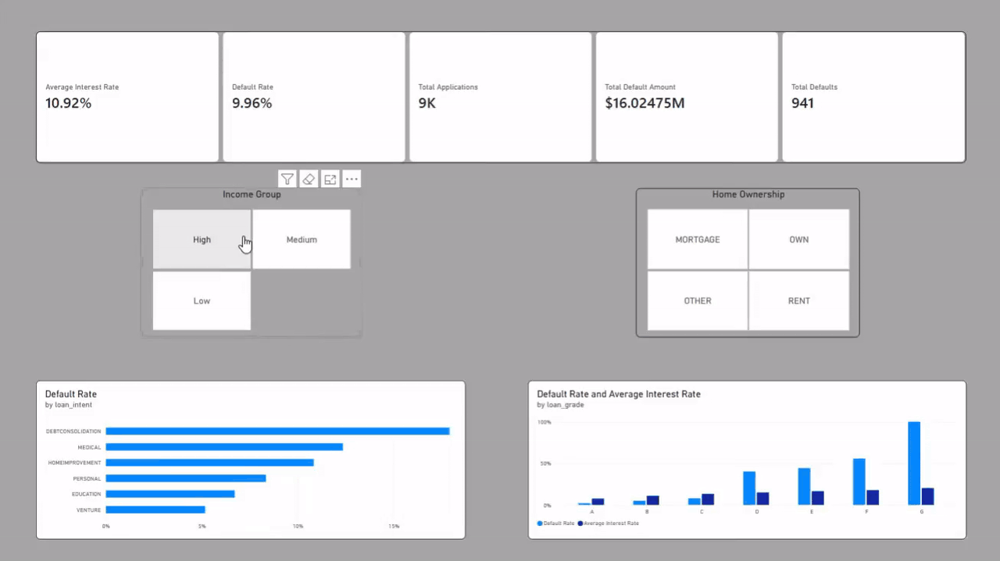
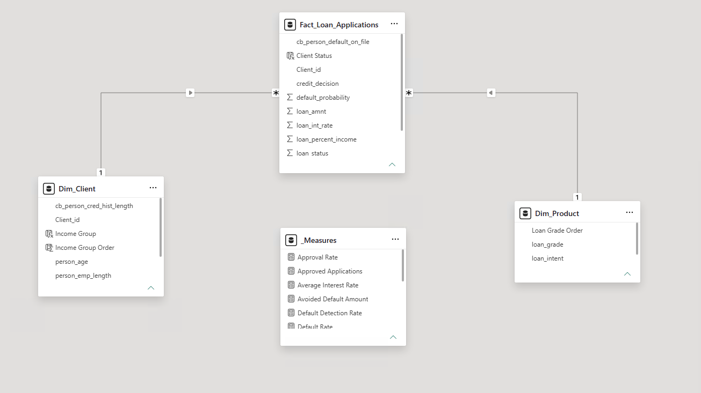
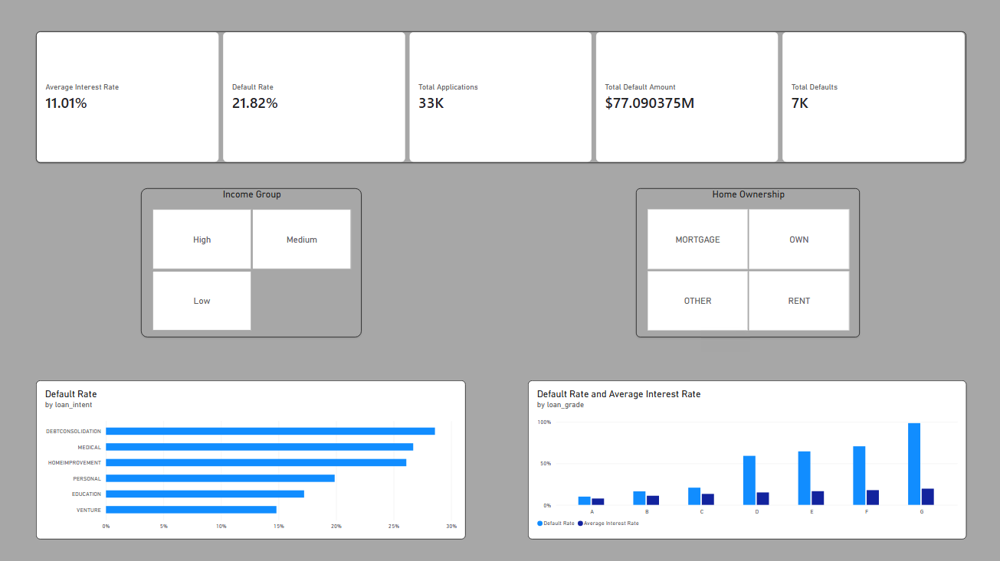
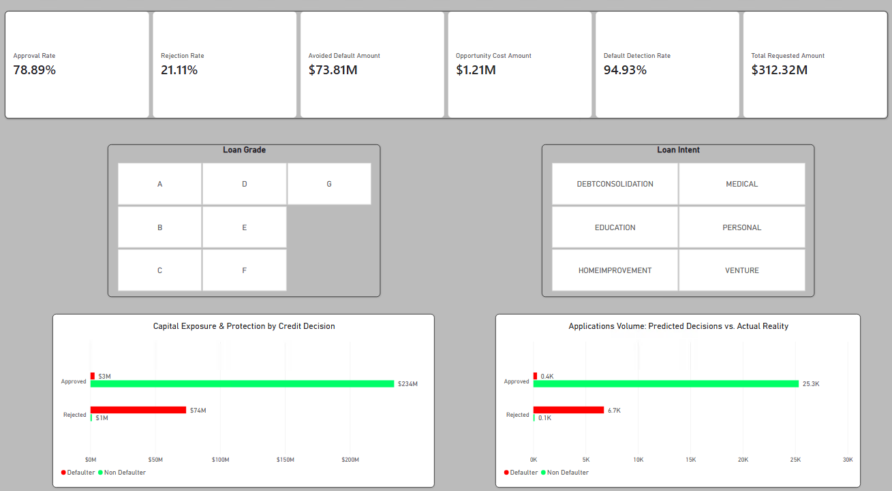

# 📊 Credit Risk Analytics: Pipeline de Machine Learning & Dashboard en Power BI

Solución integral de riesgo crediticio que combina ingeniería de datos, modelos predictivos en Python para estimar la probabilidad de incumplimiento y un tablero interactivo en Power BI diseñado para la toma de decisiones financieras y control del capital.



---

## 🎯 Preguntas Guía de Negocio

### 1. Análisis Descriptivo (¿Qué pasó en la cartera?) 🏛️
* **Exposición y Pérdida:** ¿Cuál es la tasa de mora histórica y qué volumen total de dinero representó esa pérdida para la entidad?
* **Segmentación del Riesgo:** ¿Qué perfiles concentraron el mayor incumplimiento (según grado del préstamo, destino del crédito, nivel de ingresos o antigüedad laboral)?
* **Rentabilidad vs. Riesgo:** ¿La tasa de interés aplicada compensó adecuadamente el nivel de riesgo de los clientes?

### 2. Análisis Predictivo (¿Qué va a pasar con Machine Learning?) 🤖
* **Capacidad de Detección:** ¿Qué porcentaje de morosos reales logra predecir el algoritmo antes de otorgar el crédito?
* **Impacto de la Decisión:** ¿Cuántas solicitudes se aprueban o rechazan según la política de crédito actual?
* **Costo de Oportunidad vs. Protección de Capital:** ¿Cuánto capital en mora potencial se evita prestar frente a cuánto dinero se deja de colocar por clientes solventes rechazados?

---

## 🤖 Estrategia de Modelado y Resultados

El problema se abordó como una **clasificación binaria** supervisada sobre la variable objetivo `loan_status` ($0$ = Cumplidor, $1$ = Moroso), priorizando la protección del capital frente a préstamos incobrables.

### Comparativa de Modelos y Ajuste de Política

| Modelo | Umbral de Corte | Precision (Mora) | Recall (Mora) | F1-Score | Accuracy Global | Diagnóstico de Negocio |
| :--- | :---: | :---: | :---: | :---: | :---: | :--- |
| **Regresión Logística (Baseline)** | 0.50 | 0.73 | 0.49 | 0.59 | 0.85 | Insuficiente: 51% de los morosos no fue detectado (723 fugas de capital). |
| **Random Forest (Estándar)** | 0.50 | **0.98** | 0.71 | **0.82** | **0.93** | Excelente precisión, pero deja escapar a un 29% de deudores. |
| **Random Forest (Class Weight Balanced)** | 0.50 | 0.91 | 0.72 | 0.81 | 0.92 | El balanceo forzado penalizó precisión sin mover el recall significativamente. |
| **Random Forest (Política Calibrada)** | **0.35** | 0.90 | **0.75** | 0.81 | **0.93** | **Modelo Seleccionado:** Detecta al 75% de los morosos (1.066 casos) con 90% de confiabilidad. |

> **> **Criterio de Negocio (Umbral 0.35):** En gestión de riesgo financiero, esperar a una certeza del 50% para frenar un préstamo no es lo más recomendable. Se fijó el corte en el 35% de probabilidad de mora, permitiendo así interceptar a cientos de deudores adicionales antes del desembolso y manteniendo una tasa de falsas alarmas extremadamente baja.
---

## 🛠️ Stack Tecnológico

* **Sistema Operativo & Entorno de Trabajo:** CachyOS (Linux) con VS Code.
* **Integración de Power BI (Winboat):** Ejecución de Power BI Desktop mediante **Winboat**, solución que permite correr software nativo de Windows de forma integrada y sin fisuras en el escritorio de Linux, unificando todo el ciclo de desarrollo en un único sistema operativo.
* **Lenguaje & Entorno Analítico:** Python 3.14.
* **Ciencia de Datos & Machine Learning:**
  * `pandas` & `numpy`: Limpieza, saneamiento de outliers, imputaciones y transformaciones tabulares.
  * `scikit-learn`: Partición estratificada (80/20), algoritmos de ensamble (Random Forest), optimización de corte probabilístico con `predict_proba()` y métricas de evaluación de riesgo.
* **Business Intelligence & Data Modeling:**
  * `Power BI Desktop`: Modelado dimensional en estrella (*Star Schema*), optimización para el motor columnar VertiPaq, formulación de métricas en DAX y diseño de interfaz ejecutiva.

---

## 🔄 Arquitectura del Pipeline

```text
[ Dataset Histórico (Crudo) ]
             │
             ▼
[ EDA, Limpieza y Tratamiento de Outliers (01_eda_credit_data.ipynb) ]
             │
             ▼
[ Partición Estratificada (Train 80% / Test 20%) ]
             │
             ▼
[ Entrenamiento Random Forest & Calibración de Umbral (0.35) (02_ml_credit_data.ipynb) ]
             │
             ▼
[ Exportación: credit_risk_final_dataset.csv ]
  (Incluye: probabilidad_mora, prediccion_mora y decision_crediticia)
             │
             ▼
[ Dashboard Ejecutivo en Power BI (Seguimiento & KPIs de Riesgo) ]
```

---

## 📐 Modelado Dimensional en Estrella (Star Schema)

Para garantizar un desempeño óptimo en el motor en memoria **VertiPaq** y eliminar ambigüedades en la propagación de contextos, los datos se estructuraron bajo un **Esquema en Estrella (*Star Schema*)** siguiendo las directrices de diseño dimensional de Ralph Kimball:



### 1. Tabla de Hechos (`Fact_Loan_Applications`)
Centraliza el evento transaccional del negocio (la solicitud y otorgamiento del préstamo):
* **Métricas Cuantitativas y Aditivas:** Almacena valores continuos sobre los cuales se calculan sumas, promedios y ratios: `loan_amnt` (monto del crédito), `loan_int_rate` (tasa de interés anual), `loan_percent_income` (porcentaje sobre el salario) y `loan_status` (etiqueta histórica de mora: $0$ = Cumplidor, $1$ = Moroso).
* **Outputs Predictivos de Machine Learning:** Integra los atributos derivados del modelo de Python: `default_probability` (probabilidad continua estimada de no pago), `credit_decision` (decisión recomendada según la política de corte a 0.35: Aprobado / Rechazado) y `Client Status` (clasificación calculada del estado del cliente).
* **Claves Foráneas (*Foreign Keys*):** Llaves técnicas (`Client_id`, variables de producto) para enlazar cada transacción con sus dimensiones correspondientes.

### 2. Tablas de Dimensiones (`Dim_`)
Describen las entidades de negocio respondiendo al *¿Quién?*, *¿Por qué?* y *¿En qué categoría?*. Filtran y segmentan la tabla de hechos en gráficos, leyendas y *slicers*:
* **`Dim_Client`**: Almacena el perfil sociodemográfico y financiero del solicitante. Clave primaria única `Client_id` (sin duplicados), `person_age` (edad), `person_emp_length` (antigüedad laboral en años), `cb_person_cred_hist_length` (longitud del historial crediticio) y categorías de ingreso (`Income Group`, ordenado cronológica y jerárquicamente por la columna `Income Group Order`).
* **`Dim_Product`**: Agrupa los atributos del crédito ofrecido: destino de los fondos (`loan_intent`: educación, consolidación de deuda, mejoras del hogar, etc.) y la calificación de riesgo crediticio (`loan_grade`: A, B, C, D, E, F, G), ordenada por `Loan Grade Order` para preservar la jerarquía comercial en todos los visuales.

### 3. Vínculos, Cardinalidad y Propagación de Filtros
* **Cardinalidad Estricta 1 a Varios ($1:\ast$):** Cada registro existe de manera única en las tablas de dimensiones (lado 1) y se asocia a una o múltiples solicitudes en la tabla de hechos (lado $\ast$).
* **Dirección de Filtro Única (*Single Direction*):** El flujo de filtrado viaja exclusivamente desde las dimensiones hacia los hechos ($\text{Dim} \longrightarrow \text{Fact}$). Esto optimiza la compresión por columnas y diccionarios hash de VertiPaq, previene cálculos circulares y garantiza totales consistentes.

### 4. Tabla Centralizada de Medidas (`_Medidas`)
* Tabla técnica vacía y desconectada del modelo de relaciones. Su exclusivo propósito es centralizar las fórmulas DAX, aislando la lógica de negocio de las columnas físicas para facilitar el mantenimiento y la escalabilidad del informe.

---

## 🗂️ Arquitectura de Medidas DAX (Display Folders)

Las medidas se encuentran organizadas en subcarpetas de visualización (*Display Folders*) asignadas desde la **Vista de Modelo 📐** para diferenciar la analítica diagnóstica de la analítica predictiva:

### 📁 `01_Descriptive` (Diagnóstico de Cartera Histórica)
* `[Total Applications]`: Conteo total de solicitudes de crédito evaluadas.
* `[Total Defaults]`: Cantidad de créditos en cesación de pagos real.
* `[Default Rate]`: Tasa porcentual histórica de mora.
* `[Total Default Amount]`: Exposición monetaria total perdida por créditos impagos.
* `[Average Interest Rate]`: Tasa de interés promedio ponderada de la cartera crediticia.

### 📁 `02_Predictive` (Impacto del Modelo de Machine Learning - Umbral 0.35)
* `[Detected Defaults]`: Morosos reales interceptados preventivamente por el algoritmo antes del desembolso.
* `[Default Detection Rate]`: Sensibilidad o cobertura del algoritmo sobre los deudores reales.
* `[Approved Applications]`: Solicitudes aceptadas bajo la política de riesgo.
* `[Approval Rate]`: Porcentaje de créditos aprobados sobre el total de solicitudes.
* `[Rejected Applications]`: Solicitudes denegadas preventivamente por riesgo excesivo.
* `[Rejection Rate]`: Porcentaje de solicitudes rechazadas.
* `[Avoided Default Amount]`: Capital protegido al no desembolsar a clientes morosos detectados.
* `[Opportunity Cost Amount]`: Dinero no colocado a causa de denegaciones a clientes solventes.

---

## 🖥️ Vistas del Dashboard Ejecutivo en Power BI

El reporte implementa una navegación de dos vistas ejecutivas complementarias:

### 🏛️ 1. Vista Descriptiva (Comportamiento Histórico de la Cartera)
Permite auditar la cartera otorgada, detectando que la mora se concentró fuertemente en créditos para consolidación de deuda y urgencias médicas, así como en las calificaciones de riesgo inferiores (grados D a G), donde las tasas de interés no compensaban el nivel de impago.



### 🤖 2. Vista Predictiva (Simulación y Control de la Política ML)
Monitorea la aplicación del algoritmo calibrado al umbral $0.35$: logra frenar a 9 de cada 10 deudores riesgosos con una tasa de falsas alarmas mínima, protegiendo decenas de millones de dólares en capital con un impacto casi nulo sobre clientes solventes.



---

## 📁 Estructura del Proyecto

```text
credit_risk_analytics/
├── assets/                          # Diagramas de arquitectura, capturas de pantalla y demostración interactiva
├── dashboards/                      # Reporte interactivo de Power BI (.pbix) con modelo VertiPaq
├── data/
│   ├── raw/
│   │   └── credit_risk_dataset.csv  # Dataset original (crudo)
│   └── processed/
│       ├── credit_risk_dataset_cleaned.csv # Dataset con nulos imputados y outliers saneados
│       └── credit_risk_final_dataset.csv   # Dataset final con probabilidades, predicción y decisión
├── notebooks/
│   ├── 01_eda_credit_data.ipynb     # EDA, análisis exploratorio, imputaciones y outliers
│   └── 02_ml_credit_data.ipynb      # Modelado, Random Forest, tuning de umbral y scoreo
└── README.md                        # Documentación integral del proyecto
```